# Image Feature Matching — ผลการทดสอบ

ระบบตรวจจับวัตถุโดยใช้ Feature Matching (ORB + BFMatcher) เปรียบเทียบ template ภาพนิ่งกับวิดีโอ  
แต่ละ case แสดง: ภาพ frame ที่ตรวจจับได้ + GIF แสดง bounding polygon ขณะวัตถุเคลื่อนไหว

---

## Easy Success Cases (e1–e5)

วัตถุที่มี texture ชัดเจน แสงดี มุมตรง — คาดว่าตรวจจับได้ทุก frame

**เทคนิคและพารามิเตอร์ที่ใช้ร่วมกันทุก easy case:**

| พารามิเตอร์ | ค่า | ความหมาย |
|---|---|---|
| Detector | **SIFT** | Scale-Invariant Feature Transform — 128-dim float descriptor, invariant ต่อ scale & rotation |
| Preprocessing | **CLAHE** | Contrast Limited Adaptive Histogram Equalization — เพิ่ม local contrast ก่อน detect keypoint |
| Matcher | **FLANN + KD-tree** | Approximate nearest-neighbor สำหรับ float descriptor (KD-tree index, trees=5, checks=50) |
| Ratio threshold | **0.75** | Lowe's ratio test — เก็บเฉพาะ match ที่ best distance < 0.75 × second-best distance |
| min_matches | **10** | จำนวน good matches ขั้นต่ำก่อนพยายาม compute homography |
| min_inliers | **8** | จำนวน RANSAC inliers ขั้นต่ำเพื่อยืนยันว่า detect ได้ |
| ransac_thresh | **5.0 px** | Reprojection error threshold ของ RANSAC |
| Localization | **findHomography + RANSAC** | คำนวณ 3×3 perspective transform แล้วฉาย 4 corners ของ template ลงบน frame |

---

### e1 — Spiral Notebook Cover "pplus" (Hand-held Frontal)

| Template | Output GIF |
|---|---|
| 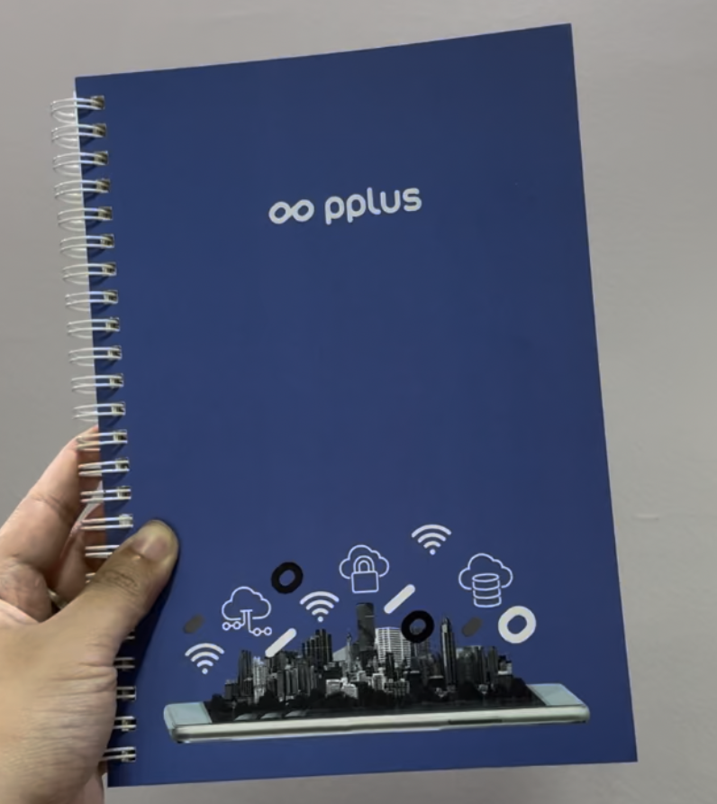 |  |

**ที่มา:** ถ่ายเอง  
**วัตถุเป้าหมาย:** ปกสมุดโน้ต spiral สีน้ำเงิน แบรนด์ "pplus"  
**Template:** `templates/easy/template_e1.jpg` | **Video:** `videos/easy/video_e1.mp4`

**อธิบายเทคนิคและผลลัพธ์:**  
ปกสมุดมีภาพ IoT icons, cityscape และโลโก้ที่ให้ fine-detail texture สูง SIFT ตรวจจับ keypoint ได้จำนวนมากบริเวณเส้นและขอบภาพประกอบ ถือสมุดด้วยมือหันหน้ากล้องตรง พื้นหลังผนังเรียบ (low texture) ลด false match CLAHE เพิ่ม local contrast บริเวณ icon สีขาวบน background น้ำเงิน ระบบ detect และวาด bounding polygon ครอบสมุดได้ถูกต้องตลอดวิดีโอ

---

### e2 — Airbus A380 Approaching Landing

| Template | Output GIF |
|---|---|
|  |  |

**ที่มา:** YouTube — https://www.youtube.com/watch?v=d-p1UFcj14U&t=633s  
**วัตถุเป้าหมาย:** เครื่องบิน Airbus A380 กำลังบินเข้าสู่รันเวย์  
**Template:** `templates/easy/template_e2.jpg` | **Video:** `videos/easy/video_e2.mp4`

**อธิบายเทคนิคและผลลัพธ์:**  
ถ่ายเครื่องบินจากด้านหน้าตรง (head-on) ใต้ท้องเครื่องมีโครงสร้างชัดเจน ได้แก่ เครื่องยนต์ 4 ตัว ช่วงล้อ และขอบปีก ซึ่งเป็น high-gradient edge ที่ SIFT ชอบ ท้องฟ้าที่สม่ำเสมอแทบไม่มี keypoint รบกวน วัตถุค่อยๆ ขยายขึ้นขณะเครื่องบินบินเข้าหา SIFT รับมือกับ scale change ผ่าน scale-space pyramid ได้ดี ระบบ track เครื่องบินได้ตลอดคลิป

---

### e3 — Joker Playing Card (Overhead on Grey Surface)

| Template | Output GIF |
|---|---|
| 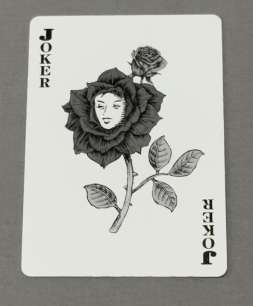 |  |

**ที่มา:** ถ่ายเอง  
**วัตถุเป้าหมาย:** ไพ่ Joker (ภาพดอกกุหลาบ + ใบหน้า)  
**Template:** `templates/easy/template_e3.jpg` | **Video:** `videos/easy/video_e3.mp4`

**อธิบายเทคนิคและผลลัพธ์:**  
ไพ่ Joker มีภาพดอกกุหลาบและใบหน้าลายเส้นละเอียดมาก SIFT ตรวจจับ keypoint ได้หนาแน่นบน fine-line artwork วางบนพื้นสีเทา (neutral grey) ที่มี texture ต่ำ ทำให้แทบไม่มี keypoint จากพื้นหลังมารบกวน กล้องมองจากบนลงล่างตรงๆ วัตถุแบนแข็ง homography compute ได้แม่นยำ ผลลัพธ์เสถียรตลอดวิดีโอ

---

### e4 — USB-C Hub (Static on White Background)

| Template | Output GIF |
|---|---|
| 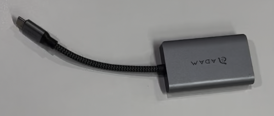 |  |

**ที่มา:** ถ่ายเอง  
**วัตถุเป้าหมาย:** USB-C Hub ยี่ห้อ ADAN  
**Template:** `templates/easy/template_e4.jpg` | **Video:** `videos/easy/video_e4.mp4`

**อธิบายเทคนิคและผลลัพธ์:**  
อุปกรณ์ USB-C Hub โลหะสีเทา วางบนพื้นขาวเรียบ ขอบโลหัส, ช่องพอร์ต และโลโก้ ADAN ให้ keypoint ที่ stable บนพื้นขาวที่แทบไม่มี keypoint รบกวน กล้องนิ่งเกือบตลอด การเปลี่ยน scale และ rotation น้อยมาก ระบบ detect ได้สม่ำเสมอตลอดวิดีโอ

---

### e5 — Oreo Snack Wrapper (Hand-held Against White Background)

| Template | Output GIF |
|---|---|
| 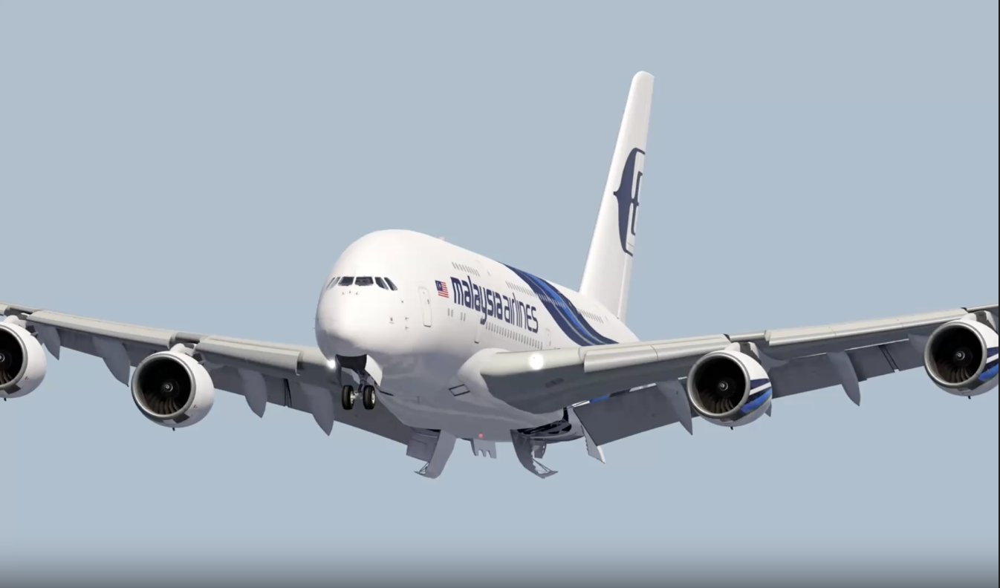 |  |

**ที่มา:** ถ่ายเอง  
**วัตถุเป้าหมาย:** ซองขนม Oreo (บรรจุภัณฑ์ภาษาจีน) ถือในมือ  
**Template:** `templates/easy/template_e5.jpg` | **Video:** `videos/easy/video_e5.mp4`

**อธิบายเทคนิคและผลลัพธ์:**  
ซองขนม Oreo สีน้ำเงินเข้มพร้อมโลโก้และตัวอักษรจีนที่ชัดเจน ให้ high-contrast keypoint ที่ discriminative สูง พื้นหลังขาวสว่างป้องกัน false match จากสิ่งแวดล้อม ถือด้วยมือทำให้เกิด translation เล็กน้อย แต่ซองยังคง flat อยู่ homography compute ได้ถูกต้อง CLAHE ช่วย normalize ความสว่างระหว่าง template กับ frame ระบบ detect ตลอดวิดีโอ

---

## Difficult Success Cases (d1–d5)

ตรวจจับสำเร็จ แต่มีปัจจัยรบกวน 1 อย่างต่อ case — ใช้พารามิเตอร์ที่ปรับละเอียดขึ้นเพื่อรับมือ

**พารามิเตอร์ที่แตกต่างจาก Easy Cases:**

| พารามิเตอร์ | Easy cases | Difficult cases | เหตุผล |
|---|---|---|---|
| ratio | 0.75 | **0.70** | เข้มงวดขึ้น กรอง ambiguous match จาก background รบกวน |
| min_matches | 10 | **8** | วัตถุอาจถูกบังบางส่วน keypoint น้อยลงได้ |
| min_inliers | 8 | **6** | ยอมรับ inlier น้อยลงสำหรับกรณียากขึ้น |
| ransac_thresh | 5.0 px | **5.0–7.0 px** | ผ่อนปรนตาม deformation ของแต่ละ case |

---

### d1 — Plaid Notebook (Partial Hand Occlusion on Wooden Table)

| Template | Output GIF |
|---|---|
| 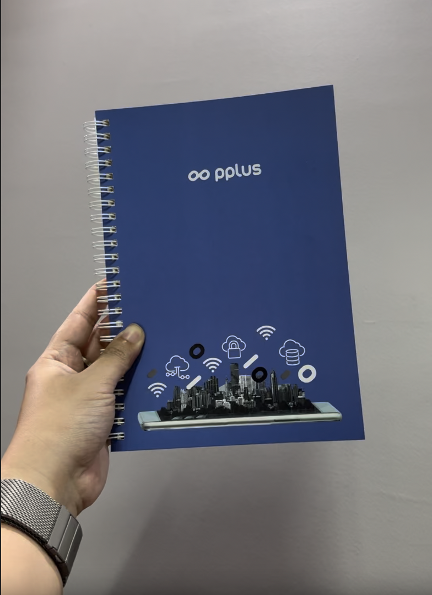 |  |

**ที่มา:** YouTube — https://www.youtube.com/watch?v=DD7lU3S_jpY  
**วัตถุเป้าหมาย:** สมุดโน้ตลาย plaid (ตาราง) สีน้ำเงิน  
**Template:** `templates/difficult/template_d1.jpg` | **Video:** `videos/difficult/video_d1.mp4`  
**Parameters:** ratio=0.70, min_matches=8, min_inliers=6, ransac_thresh=5.0

**ความยากที่พบ:**
1. **Partial occlusion** — มือทั้งสองบังขอบสมุดประมาณ 30% ทำให้ keypoint บริเวณนั้นหายไป
2. **Texture confusion** — ลายไม้บนโต๊ะมี horizontal grain ที่ SIFT descriptor คล้ายกับเส้น grid ของสมุด ทำให้เกิด false match ข้าม surface

**วิธีที่ทำให้สำเร็จ:** Ratio test ที่เข้มขึ้น (0.70) ช่วยกรอง match ที่ไม่ชัดเจนออก ส่วนที่ไม่ถูกบังยังคง keypoint เพียงพอให้ RANSAC compute homography ได้ถูกต้อง

---

### d2 — Pigeons in Flight (Dynamic Cloudy Sky Background)

| Template | Output GIF |
|---|---|
| 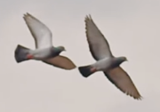 |  |

**ที่มา:** YouTube — https://www.youtube.com/watch?v=wZVbPe5HVvg  
**วัตถุเป้าหมาย:** นกพิราบ 2 ตัวกำลังบิน  
**Template:** `templates/difficult/template_d2.jpg` | **Video:** `videos/difficult/video_d2.mp4`  
**Parameters:** ratio=0.70, min_matches=8, min_inliers=6, ransac_thresh=5.0

**ความยากที่พบ:**
1. **Dynamic background** — เมฆเคลื่อนไหวตลอดเวลา สร้าง false keypoint บน background
2. **Repetitive texture** — ขนนกมี pattern ซ้ำกัน descriptor คล้ายกันหลายจุด ทำให้ ratio test ยากขึ้น
3. **Wing motion** — ปีกขยับทุก frame ทำให้ส่วนปลายปีกเปลี่ยน appearance

**วิธีที่ทำให้สำเร็จ:** CLAHE เพิ่ม contrast บน body นกเทียบกับท้องฟ้าสว่าง Ratio (0.70) กรอง cloud false-match ออก ลำตัวนกซึ่ง rigid พอให้ homography ยึด

---

### d3 — White Cat in Dark Car Scene (Low Light & Cluttered Background)

| Template | Output GIF |
|---|---|
| 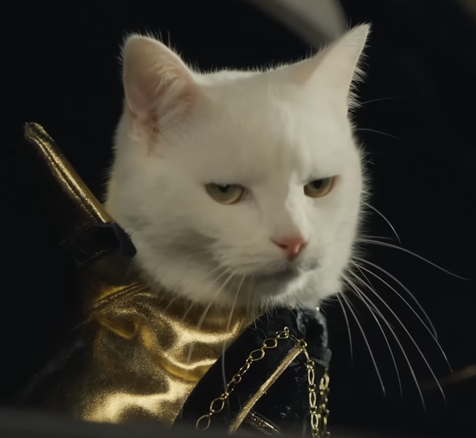 |  |

**ที่มา:** YouTube — https://youtu.be/ZH7umQiTBlI?si=gX_j9VFGwV1NfnQ9  
**วัตถุเป้าหมาย:** แมวขาวสวมเสื้อสีทอง ในรถยนต์  
**Template:** `templates/difficult/template_d3.jpg` | **Video:** `videos/difficult/video_d3.mp4`  
**Parameters:** ratio=0.70, min_matches=8, min_inliers=6, ransac_thresh=6.0

**ความยากที่พบ:**
1. **Low light** — ฉากในรถมืดมาก gradient magnitude ต่ำ SIFT ตรวจจับ keypoint ได้น้อยกว่าปกติ
2. **Complex background** — ผู้โดยสาร 2 คน และเบาะรถสร้าง competing keypoint จำนวนมาก
3. **Low-texture fur** — ขนแมวขาวล้วนมี contrast ต่ำภายใน keypoint ส่วนใหญ่มาจากใบหน้าและเสื้อทองเท่านั้น

**วิธีที่ทำให้สำเร็จ:** CLAHE ทำงาน tile-by-tile ช่วย recover edge ในบริเวณมืด เสื้อสีทองและลักษณะใบหน้าให้ discriminative keypoint เพียงพอ Ransac_thresh=6px รองรับการเปลี่ยน viewpoint เล็กน้อย

---

### d4 — Sea Turtle Underwater (Color Cast & Coral Background)

| Template | Output GIF |
|---|---|
| 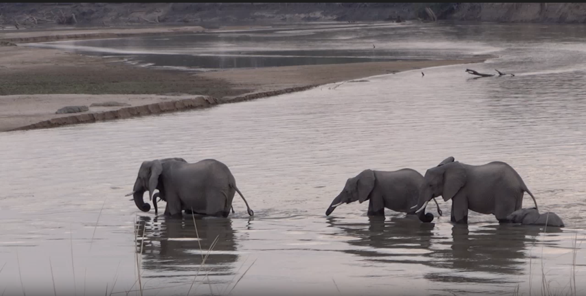 |  |

**ที่มา:** YouTube — https://www.youtube.com/watch?v=klK6mX8jnHQ  
**วัตถุเป้าหมาย:** เต่าทะเล (green sea turtle)  
**Template:** `templates/difficult/template_d4.jpg` | **Video:** `videos/difficult/video_d4.mp4`  
**Parameters:** ratio=0.70, min_matches=8, min_inliers=6, ransac_thresh=7.0

**ความยากที่พบ:**
1. **Underwater color cast** — น้ำทะเลดูดซับแสงสีแดง ทำให้ภาพมี blue-green cast และขอบวัตถุเบลอเล็กน้อย
2. **Textured background** — ปะการังที่มี texture สูงสร้าง competing keypoint จำนวนมาก
3. **Viewpoint change** — เต่าว่ายน้ำเปลี่ยนมุมมองตลอดเวลา

**วิธีที่ทำให้สำเร็จ:** SIFT ทำงานบน grayscale gradient ดังนั้น color cast กระทบน้อย CLAHE recover edge ที่ถูก water blur RANSAC ด้วย ransac_thresh=7px รองรับ perspective change จากการว่ายน้ำ ลวดลาย scute บนกระดองให้ keypoint ที่ stable

---

### d5 — Elephant Herd Crossing River (Similar-instance Confusion)

| Template | Output GIF |
|---|---|
| 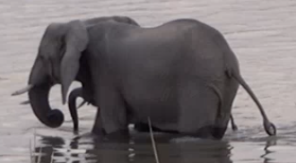 |  |

**ที่มา:** Kaggle — https://www.kaggle.com/code/mistag/play-video-in-notebook/input  
**วัตถุเป้าหมาย:** ช้างตัวหนึ่งในฝูง (ใช้ template ช้างตัวเดียว)  
**Template:** `templates/difficult/template_d5.jpg` | **Video:** `videos/difficult/video_d5.mp4`  
**Parameters:** ratio=0.70, min_matches=8, min_inliers=6, ransac_thresh=5.0

**ความยากที่พบ:**
1. **Similar-instance confusion** — ช้างหลายตัวในฉากมี texture และ silhouette คล้ายกับ template SIFT อาจ match ข้ามตัวได้
2. **Low boundary contrast** — ผิวหนังช้างสีเทากับโคลนสีน้ำตาล-เทาของแม่น้ำมีโทนใกล้เคียงกัน ขอบวัตถุ gradient ต่ำ
3. **Water ripples** — แสงสะท้อนในน้ำสร้าง noisy keypoint บริเวณขาช้าง

**วิธีที่ทำให้สำเร็จ:** Ratio (0.70) ลด cross-individual false match CLAHE เพิ่ม contrast บน skin-fold detail RANSAC จัดกลุ่ม inlier ที่ consistent กับช้างตัวเดียวออกจาก outlier ตัวอื่น

---

## Expected Fail Cases (f1–f5)

วัตถุ/ฉากที่ incompatible กับ feature-point matching โดยพื้นฐาน — คาดการณ์ว่าจะ fail ตั้งแต่ก่อนลองทำ

แต่ละ case อธิบาย: (1) วิธีที่ได้ลองแล้ว (2) สาเหตุที่ fail (3) เทคนิคที่น่าจะช่วยได้

---

### f1 — Pedestrian on Busy London Street

| Template | Output GIF |
|---|---|
| 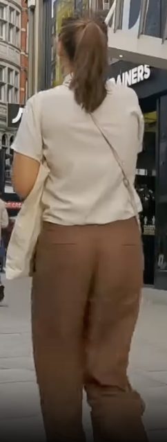 |  |

**ที่มา:** YouTube — https://www.youtube.com/watch?v=YzcawvDGe4Y  
**วัตถุเป้าหมาย:** ผู้หญิงคนหนึ่ง (เสื้อขาว กางเกงน้ำตาล มองด้านหลัง) ในฝูงชน  
**Template:** `templates/expected_fail/template_f1.jpg` | **Video:** `videos/expected_fail/video_f1.mp4`

**วิธีที่ลองแล้ว:** SIFT + CLAHE + FLANN + RANSAC (ratio=0.75, min_inliers=8) ตาม pipeline มาตรฐาน

**สาเหตุที่ fail:**
1. **Background dominance** — อาคาร ป้ายร้านค้า และพื้นถนนมี SIFT keypoint มากกว่าเสื้อผ้าของบุคคลเป้าหมายหลายเท่า ระบบ lock onto สถาปัตยกรรมแทน
2. **Non-rigid motion** — ร่างกายคนไม่ใช่ rigid body แขนขาแกว่ง posture เปลี่ยนทุก frame homography ไม่สามารถ model ได้
3. **Occlusion** — คนอื่นในฝูงชนบังตัวเป้าหมายบ่อย keypoint หายไปเป็นช่วงๆ

**เทคนิคที่น่าจะช่วยได้:** ต้องการความสามารถด้าน **Person Re-identification** (appearance embedding) หรือ **Pose Estimation** เพื่อ track ด้วย body keypoints แทน image patch

---

### f2 — White Van on Highway Traffic

| Template | Output GIF |
|---|---|
| 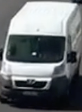 |  |

**ที่มา:** YouTube — https://www.youtube.com/watch?v=nt3D26lrkho&t=22s  
**วัตถุเป้าหมาย:** รถตู้สีขาว (delivery van) บนไฮเวย์  
**Template:** `templates/expected_fail/template_f2.jpg` | **Video:** `videos/expected_fail/video_f2.mp4`

**วิธีที่ลองแล้ว:** SIFT + CLAHE + FLANN + RANSAC (ratio=0.75, min_inliers=8) ตาม pipeline มาตรฐาน

**สาเหตุที่ fail:**
1. **Rapid transit** — รถวิ่งผ่าน frame ใน 1–2 วินาที มี view น้อยเกินไปสำหรับ stable matching
2. **Instance confusion** — รถตู้ขาวหลายคันในฉากมี descriptor คล้ายกันมาก SIFT แยก target จาก lookalike ไม่ได้
3. **Repetitive background** — เส้นถนน ป้ายจราจร และแบริเออร์สร้าง false match ท่วม match จากรถ

**เทคนิคที่น่าจะช่วยได้:** ต้องการความสามารถด้าน **Multi-object Tracking** (SORT/DeepSORT) และ **Vehicle Re-ID** เพื่อ associate detection ข้าม frame

---

### f3 — EU Flag Waving in Wind

| Template | Output GIF |
|---|---|
|  |  |

**ที่มา:** YouTube — https://www.youtube.com/watch?v=cAgyPg1gEPA  
**วัตถุเป้าหมาย:** ธงสหภาพยุโรป (EU flag)  
**Template:** `templates/expected_fail/template_f3.jpg` | **Video:** `videos/expected_fail/video_f3.mp4`

**วิธีที่ลองแล้ว:** SIFT + CLAHE + FLANN + RANSAC (ratio=0.75, min_inliers=8) ตาม pipeline มาตรฐาน

**สาเหตุที่ fail:**
1. **Non-rigid deformation** — ผ้าธงโบกสะบัด บิด พับ และบังตัวเองอย่างต่อเนื่อง homography (planar model) ไม่สามารถ model cloth deformation ได้
2. **Keypoint disappearance** — ดาวบนธงหายไปเบื้องหลังรอยพับแล้วกลับมาในตำแหน่งต่างกัน point correspondence ขาดช่วงตลอดเวลา
3. **Sky confusion** — ท้องฟ้าสีน้ำเงินเหมือนธงทำให้ descriptor บริเวณขอบไม่ discriminative

บาง frame มี bounding box ปรากฏแต่ผิดรูปทรงอย่างมากและ unstable → ถือว่า fail

**เทคนิคที่น่าจะช่วยได้:** ต้องการความสามารถด้าน **Non-rigid Registration** (thin-plate spline, mesh-based deformation) หรือ **Dense Optical Flow** เพื่อ track ผิวผ้า

---

### f4 — Shark in Deep Ocean

| Template | Output GIF |
|---|---|
| 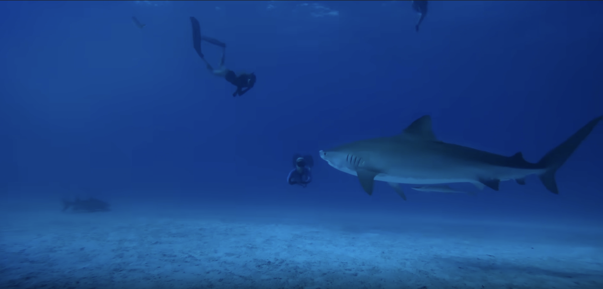 |  |

**ที่มา:** YouTube — https://youtu.be/eoTpdTU8nTA?si=N3zjon83FwVY4fNC  
**วัตถุเป้าหมาย:** ฉลาม (shark) ใต้ทะเลลึก  
**Template:** `templates/expected_fail/template_f4.jpg` | **Video:** `videos/expected_fail/video_f4.mp4`

**วิธีที่ลองแล้ว:** SIFT + CLAHE (เพิ่ม clipLimit) + FLANN + RANSAC ตาม pipeline มาตรฐาน; ลอง CLAHE เข้มข้นขึ้น

**สาเหตุที่ fail:**
1. **Camouflage** — ตัวฉลามและน้ำทะเลลึกเป็นสีน้ำเงิน-เทาเหมือนกัน gradient บริเวณขอบตัวฉลามแทบเป็นศูนย์ SIFT ไม่พบ keypoint บนตัวฉลามเลย
2. **Underwater color absorption** — น้ำดูดซับแสงสีแดง ภาพ grayscale สูญเสีย contrast ทั้งหมด CLAHE ช่วยได้จำกัดเพราะไม่มี gradient อยู่แต่แรก
3. **False keypoints** — keypoint ที่ตรวจพบมาจาก caustic light บนพื้นทราย และจากนักดำน้ำ ไม่ใช่จากฉลาม → good matches = 0 ทุก frame

**เทคนิคที่น่าจะช่วยได้:** ต้องการความสามารถด้าน **Underwater Image Enhancement** + **Silhouette-based Shape Matching** หรือ **Infrared Imaging**

---

### f5 — Smoke / Steam (Textureless Non-rigid Object)

| Template | Output GIF |
|---|---|
| 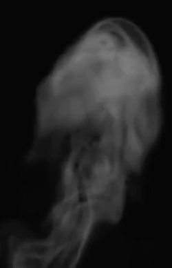 |  |

**ที่มา:** YouTube — https://www.youtube.com/watch?v=KEN6S2beTc0  
**วัตถุเป้าหมาย:** ควัน/ไอน้ำ (smoke/steam) จากถ้วยกาแฟ  
**Template:** `templates/expected_fail/template_f5.jpg` | **Video:** `videos/expected_fail/video_f5.mp4`

**วิธีที่ลองแล้ว:** SIFT + CLAHE + FLANN + RANSAC (ratio=0.75, min_inliers=8) ตาม pipeline มาตรฐาน

**สาเหตุที่ fail:**
1. **No stable texture** — ควันไม่มี texture คงที่เลย เป็น gradient อ่อนๆ ที่เปลี่ยนรูปร่างทุก frame SIFT ไม่สามารถหา repeatable keypoint ได้
2. **Fully non-rigid** — ควันขยายและเปลี่ยนรูปตลอดเวลา ไม่มีส่วนไหนของ template "คงอยู่" ในอีก frame ถัดไป homography ใช้ไม่ได้โดยสิ้นเชิง
3. **Background mismatch** — template พื้นหลังดำ video พื้นหลังโต๊ะไม้ + ความมืด descriptor บริเวณขอบควันเปลี่ยนไปทั้งหมด → good matches = 0 ทุก frame

**เทคนิคที่น่าจะช่วยได้:** ต้องการความสามารถด้าน **Dense Optical Flow** หรือ **Temporal Differencing** เพื่อ detect การเคลื่อนที่ของควัน หรือ **Generative / Probabilistic model** ของลักษณะควัน

---

## Unexpected Fail Cases (u1–u5)

วัตถุน่าจะตรวจจับได้ แต่ระบบ fail เพราะปัจจัยที่ไม่คาดคิด — เป็นกลุ่มที่เปิดเผย **ขีดจำกัดเชิงลึก** ของ feature-point matching ได้ชัดที่สุด

---

### u1 — Gold Jewelry (Earring/Pendant) — Reflective Surface & 3D Viewpoint Change

| Output frame | Output GIF |
|---|---|
|  |  |

**ที่มา:** YouTube — https://youtube.com/shorts/hz8xmkeo8qU  
**วัตถุเป้าหมาย:** ต่างหู/จี้ทองแบบ chandelier ประดับ filigree และอัญมณีสีแดง-ม่วง  
**Template:** `templates/unexpected_fail/template_u1.jpg` | **Video:** `videos/unexpected_fail/video_u1.mp4`  
**จำนวน keypoint บน template:** 1,150 จุด (สูงที่สุดใน 20 cases ทั้งหมด)

**ทำไมคาดว่าน่าจะผ่าน:**  
ลวดลาย filigree ทองและหน้าเหลี่ยมของอัญมณีให้ fine-detail gradient จำนวนมาก SIFT ตรวจพบ keypoint ถึง 1,150 จุด — มากกว่า easy case หลายตัว เหตุผลน่าจะทำให้ระบบ match ได้ง่าย

**พฤติกรรมที่สังเกตได้จาก GIF:**  
Bounding box ปรากฏ **เฉพาะ frame ที่ท่าทางของเครื่องประดับใกล้เคียง template** (frontal, lighting ตรง) เมื่อวิดีโอแสดงมุมมองอื่นหรือแสงเปลี่ยน box หายไปทันที — detection เป็นแบบ **intermittent, viewpoint-locked** ไม่ใช่ stable tracking

**สาเหตุที่ fail:**
1. **Specular reflection (viewpoint-dependent highlight)** — ผิวทองสะท้อนแสงแบบ specular จุดสว่างบน filigree และหน้าอัญมณีเปลี่ยนตำแหน่งทุกครั้งที่เครื่องประดับหมุนหรือแสงเปลี่ยน keypoint ที่อยู่บนจุดสว่างนั้น gradient magnitude และ direction เปลี่ยนทั้งหมด — descriptor ไม่ตรงกับ template แม้จะเป็นวัตถุเดิม
2. **3D object ≠ planar surface** — เครื่องประดับเป็นวัตถุ 3 มิติ การหมุนเล็กน้อยในวิดีโอทำให้เห็นหน้าของ filigree และอัญมณีชุดใหม่ที่ไม่ปรากฏใน template เลย Homography (planar model) ไม่สามารถรับมือกับ 3D perspective change ได้
3. **Gemstone curvature** — ผิวโดมของอัญมณีแต่ละเม็ดเป็น convex 3D surface ในตัวเอง สมมติฐาน planar ของ homography ถูกละเมิดแม้กระทั่งบนตัววัตถุเดียว
4. **Keypoint count ≠ match quality** — แม้มี 1,150 keypoint บน template แต่ส่วนใหญ่อยู่บนพื้นผิว specular ที่ descriptor เปลี่ยนตามแสง จำนวน keypoint สูงไม่ได้รับประกันว่าจะ match ได้ในสภาพแสงต่างกัน

**เทคนิคที่น่าจะช่วยได้:** 3D object recognition (ORB-SLAM/SuperPoint บน 3D model), Polarization imaging เพื่อแยก specular reflection ออก, หรือ multi-view template สำหรับแต่ละมุมมอง

---

### u2 — Orange Fruit — Smooth Curved Surface & Insufficient Gradient

| Output frame | Output GIF |
|---|---|
|  |  |

**ที่มา:** YouTube — https://youtu.be/GDk7Z9zkFws  
**วัตถุเป้าหมาย:** ส้มผลเดียว บนพื้นหลังเรียบ  
**Template:** `templates/unexpected_fail/template_u2.jpg` | **Video:** `videos/unexpected_fail/video_u2.mp4`  
**จำนวน keypoint บน template:** 193 จุด (ต่ำมากเทียบกับ appearance ของวัตถุ)

**ทำไมคาดว่าน่าจะผ่าน:**  
เปลือกส้มมี texture รูพรุนที่มองเห็นได้ชัดเจน สีส้มโดดเด่นสูง ดูน่าจะมี keypoint มากเพียงพอสำหรับการ match

**พฤติกรรมที่สังเกตได้จาก GIF:**  
**ไม่มี bounding box ปรากฏแม้แต่ frame เดียว** ตลอดทั้งวิดีโอ ส้มเคลื่อนไหวอยู่ในฉากแต่ระบบตรวจไม่พบเลย — เป็น **complete detection failure (0 matches)**

**สาเหตุที่ fail:**
1. **Low gradient magnitude → insufficient keypoints** — รูพรุน (pores) บนเปลือกส้มเป็นเพียง gentle bump ความสูงต่ำ gradient magnitude ต่ำมาก SIFT จึงตรวจพบได้แค่ 193 keypoint เท่านั้น ไม่ถึงครึ่งของ easy case ที่ต่ำสุด ทำให้ match pool เล็กมากตั้งแต่ต้น
2. **Repetitive texture → ratio test failure** — texture ของเปลือกส้มมีลักษณะซ้ำๆ สม่ำเสมอทั่วทั้งผิว descriptor ของ keypoint สองจุดที่อยู่ห่างกันบนผิวส้มมีค่าคล้ายกันมาก Lowe's ratio test ปฏิเสธ match เหล่านั้นว่า ambiguous — good matches ที่เหลือน้อยกว่า `min_matches=10` จึงไม่ attempt homography เลย
3. **3D spherical surface** — ส้มเป็นทรงกลม 3 มิติ การเคลื่อนไหวในวิดีโอทำให้เห็น surface patch ที่ต่างออกไปจาก template homography สมมติว่าวัตถุแบน — สมมติฐานนี้ผิดพื้นฐานสำหรับทรงกลม

**เทคนิคที่น่าจะช่วยได้:** Circular object detection (Hough Circle Transform + color segmentation by HSV hue), 3D object tracking, หรือ deep learning-based detector ที่ไม่พึ่ง local gradient

---

### u3 — Clownfish (Nemo) — Non-rigid Swimming & Coral Background Dominance

| Output frame | Output GIF |
|---|---|
|  |  |

**ที่มา:** YouTube — https://www.youtube.com/watch?v=RCOH9SD5obw&t=6744s  
**วัตถุเป้าหมาย:** ปลา Clownfish (Nemo) ลายส้ม-ขาว-ดำ  
**Template:** `templates/unexpected_fail/template_u3.jpg` | **Video:** `videos/unexpected_fail/video_u3.mp4`  
**จำนวน keypoint บน template:** 1,293 จุด (สูงมาก — เทียบได้กับ easy case)

**ทำไมคาดว่าน่าจะผ่าน:**  
ลาย stripe ส้ม-ขาว-ดำที่ contrast สูงและ pattern เป็นเอกลักษณ์ทำให้ SIFT พบ 1,293 keypoint ซึ่งมากกว่า easy case หลาย case ดูน่าจะ match ได้ง่าย

**พฤติกรรมที่สังเกตได้จาก GIF:**  
Bounding box ปรากฏและคาบบนตัวปลาในบาง frame แต่ **unstable อย่างมาก** — box กระโดดขนาดและตำแหน่งเปลี่ยนไปตาม anemone และหินปะการังโดยรอบ บาง frame box อยู่บนปลา frame ถัดไป box ขยายครอบ anemone ข้างๆ แทน ไม่สามารถ track ปลาได้อย่างต่อเนื่องตลอดวิดีโอ

**สาเหตุที่ fail:**
1. **Background dominance (coral & anemone)** — ปะการังและ anemone สีส้มที่อยู่ล้อมรอบปลามี texture หนาแน่นมากและมีโทนสีคล้ายปลาเอง SIFT พบ keypoint บน background มากกว่าบนตัวปลา matcher จึงดึง homography ไปทาง background แทน — box กระโดดออกจากปลาไปที่ anemone
2. **Template-video domain gap** — template ถ่ายปลาบน background สีดำ (isolated specimen) แต่วิดีโอมี background เป็นปะการังหลากสี descriptor บริเวณขอบปลาใน template "เห็น" black background แต่ใน video "เห็น" orange anemone — descriptor mismatch ที่ขอบวัตถุ
3. **Non-rigid body** — ครีบ หาง และลำตัวปลาโค้งงอตามการว่ายน้ำ ส่วนที่ขยับทำให้ correspondence ของ keypoint ไม่ consistent ระหว่าง frame ทำให้ inlier count ขึ้นๆ ลงๆ — box ปรากฏแล้วหายสลับกัน
4. **Caustic light** — แสง caustic ใต้น้ำสร้าง time-varying keypoint บน background เพิ่มความสับสนของ matcher ในแต่ละ frame

**เทคนิคที่น่าจะช่วยได้:** Underwater background subtraction, deep learning object detection (YOLO) ที่ train บน fish dataset, หรือ color-segmentation เพื่อ isolate ปลาออกจาก anemone ก่อน match

---

### u4 — Ink Dissolving in Water — Non-rigid Morphing & No Stable Texture

| Output frame | Output GIF |
|---|---|
|  |  |

**ที่มา:** YouTube — https://www.youtube.com/watch?v=pGbIOC83-So  
**วัตถุเป้าหมาย:** หมึก/สีน้ำสีน้ำเงินกำลังกระจายตัวในน้ำ (ink diffusion)  
**Template:** `templates/unexpected_fail/template_u4.jpg` | **Video:** `videos/unexpected_fail/video_u4.mp4`  
**จำนวน keypoint บน template:** 822 จุด (มากกว่าหลาย difficult success case)

**ทำไมคาดว่าน่าจะผ่าน:**  
กลุ่มหมึกมีรูปทรงกิ่งก้านซับซ้อน SIFT ตรวจพบ 822 keypoint ซึ่งมากเกินพอ ดูเหมือนจะมีรายละเอียดให้ match ได้

**พฤติกรรมที่สังเกตได้จาก GIF:**  
**ไม่มี bounding box ปรากฏแม้แต่ frame เดียว** หมึกกำลังกระจายตัวลงมาจากด้านบนอย่างชัดเจนในวิดีโอ แต่ระบบตรวจไม่พบเลย — เป็น **complete detection failure** เหมือนกับ case f5 (smoke) ทุกประการ แม้ template จะดู "มี structure" มากกว่า

**สาเหตุที่ fail:**
1. **Non-repeatable keypoints** — แม้จะมี 822 keypoint บน template แต่ทุก keypoint เหล่านั้นคือ snapshot ของ fluid ชั่วขณะหนึ่ง ใน frame ถัดไปหมึกกระจายและเปลี่ยนรูปทรงต่อ — structure เดิมไม่มีอยู่แล้ว ไม่มี keypoint ใดใน video ที่ตรงกับ template ได้
2. **Purely non-rigid fluid** — กลุ่มหมึกขยายตัว แตกกิ่ง และเปลี่ยนรูปร่างอย่างต่อเนื่องตามกระแส convection ใน water homography ต้องการ rigid-planar transformation — fluid deformation ละเมิดสมมติฐานนี้อย่างสมบูรณ์
3. **ภาพหลอกของ keypoint จำนวนมาก** — 822 keypoint บน template ให้ความรู้สึกว่าจะ match ได้ แต่ความจริงคือ keypoint เหล่านั้นอธิบาย "texture ของกลุ่มหมึก ณ เวลา t" เท่านั้น ซึ่งใน video ณ เวลา t+1 หมึกมีรูปร่างต่างออกไปแล้วทั้งหมด — นี่คือความต่างจาก easy case ที่ keypoint อธิบาย texture ที่คงทนบนวัตถุ rigid
4. **Zero RANSAC inliers** — ผลลัพธ์คือ good matches = 0 ทุก frame เหมือน case f5 (smoke)

**เทคนิคที่น่าจะช่วยได้:** Dense Optical Flow (Farneback) เพื่อ track การเคลื่อนที่ของกลุ่มหมึก, Temporal differencing (frame subtraction) สำหรับ detect บริเวณที่มีการเปลี่ยนแปลง, หรือ contour tracking บน thresholded blob

---

### u5 — Ant — Reflective Exoskeleton, Non-rigid Motion & Tiny Scale

| Output frame | Output GIF |
|---|---|
|  |  |

**ที่มา:** YouTube — https://youtu.be/AKQkuNifoas  
**วัตถุเป้าหมาย:** มดตัวเดียว บนพื้นหลังขาว  
**Template:** `templates/unexpected_fail/template_u5.jpg` | **Video:** `videos/unexpected_fail/video_u5.mp4`  
**จำนวน keypoint บน template:** 236 จุด

**ทำไมคาดว่าน่าจะผ่าน:**  
มดมีโครงสร้างร่างกายที่ชัดเจน (หัว อก ท้อง) พร้อมขอบเขตที่แยกออกได้ด้วยสายตา และมี 236 keypoint — ใกล้เคียงกับ case ที่สำเร็จได้หลาย case

**พฤติกรรมที่สังเกตได้จาก GIF:**  
Bounding box ปรากฏและ **ครอบคลุมมดพร้อมกัน 2 ตัว** ในคราวเดียว — quadrilateral ขยายใหญ่ครอบทั้งสองตัวแทนที่จะ track มดตัวที่ต้องการ (template) เพียงตัวเดียว นี่คือ **instance confusion + over-expanded bounding box** ซึ่งเป็น false detection ไม่ใช่ no-detection

**สาเหตุที่ fail:**
1. **Instance confusion** — มดทั้งสองตัวในวิดีโอมี descriptor เหมือนกันทุกประการ (species เดียวกัน ขนาดใกล้เคียงกัน) SIFT match keypoint ข้ามมดทั้งสองตัว inlier จึงกระจายอยู่บนมดทั้งสองพร้อมกัน RANSAC หา homography ที่ "อธิบาย" inlier ทั้งหมดด้วยการขยาย bounding box ให้ครอบทั้งสองตัว — บ้างถูก ผิดเป้าหมาย
2. **Non-rigid articulated body** — ขา 6 ข้าง หนวด และท้อง (gaster) ขยับอิสระตลอดเวลา ทำให้ geometric consistency ของ inlier ต่ำ RANSAC เลือก inlier จากทั้งสองตัวปนกัน เพราะนั่นคือชุดที่ reprojection error รวมต่ำสุด
3. **Low keypoint count → weak discrimination** — 236 keypoint บน template น้อยเกินไปสำหรับการแยกมดตัวที่ถูกต้องออกจาก lookalike เมื่อมีวัตถุ identical อยู่ใกล้กัน ต่างจาก e1–e5 ที่ template มี 500+ keypoint บน object ที่ unique กว่า
4. **Reflective chitin** — เปลือกไคตินสะท้อนแสง specular ทำให้ descriptor บน head และ gaster เปลี่ยนตามมุมแสง ยิ่งทำให้การแยกว่า match ใดมาจากมดตัวไหนทำได้ยากขึ้น

**เทคนิคที่น่าจะช่วยได้:** Instance segmentation (Mask R-CNN) ที่สามารถแยกมดแต่ละตัวออกจากกัน, หรือ tracking โดยใช้ centroid + trajectory เพื่อ maintain identity ข้าม frame แทนการ re-detect ทุก frame

---

## การรันโปรแกรม

```bash
# รัน case เดี่ยว
python run_case.py e2

# รัน case เดี่ยว พร้อม live preview
python run_case.py e2 --show

# จำกัดจำนวน frame (สำหรับทดสอบเร็ว)
python run_case.py e2 --max-frames 60

# รันทุก case และสร้าง results_summary.csv
python run_all.py
```

Output ไฟล์จะอยู่ที่ `outputs/<category>/output_{id}.mp4`, `.png`, `.gif`
