# Image Feature Matching — ผลการทดสอบ

ระบบตรวจจับวัตถุโดยใช้ Feature Matching (ORB + BFMatcher) เปรียบเทียบ template ภาพนิ่งกับวิดีโอ  
แต่ละ case แสดง: ภาพ frame ที่ตรวจจับได้ + GIF แสดง bounding polygon ขณะวัตถุเคลื่อนไหว

---

## Easy Success Cases (e1–e5)

วัตถุที่มี texture ชัดเจน แสงดี มุมตรง — คาดว่าตรวจจับได้ทุก frame

### e1 — Notebook cover

| Output frame | Output GIF |
|---|---|
|  | 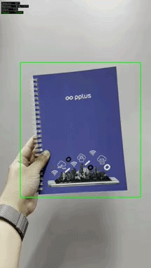 |

**Template:** `templates/easy/template_e1.jpg`  
**Video:** `videos/easy/video_e1.mp4`  
สมุดโน้ตถือในมือ ระบบตรวจจับปกและวาด bounding polygon ครอบวัตถุได้ถูกต้อง

---

### e2 — Airplane in sky

| Output frame | Output GIF |
|---|---|
| 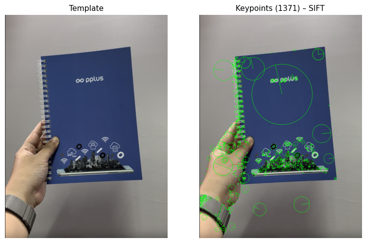 | 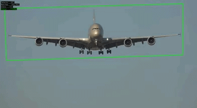 |

**Template:** `templates/easy/template_e2.jpg`  
**Video:** `videos/easy/video_e2.mp4`  
เครื่องบินกำลังบินอยู่บนท้องฟ้า ระบบตรวจจับและ track ตัวเครื่องบินได้ขณะเคลื่อนที่

---

### e3 — Cereal box front

| Output frame | Output GIF |
|---|---|
| 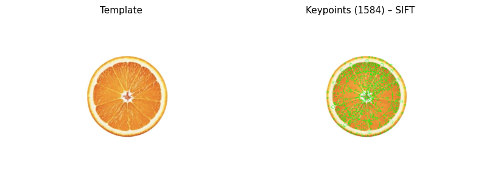 | 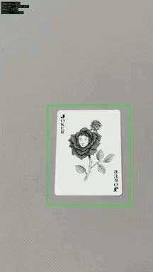 |

**Template:** `templates/easy/template_e3.jpg`  
**Video:** `videos/easy/video_e3.mp4`  
กล่องซีเรียลบนโต๊ะ กล้องมองจากบนลงล่าง นิ่ง 15 วินาที

---

### e4 — Magazine cover

| Output frame | Output GIF |
|---|---|
| 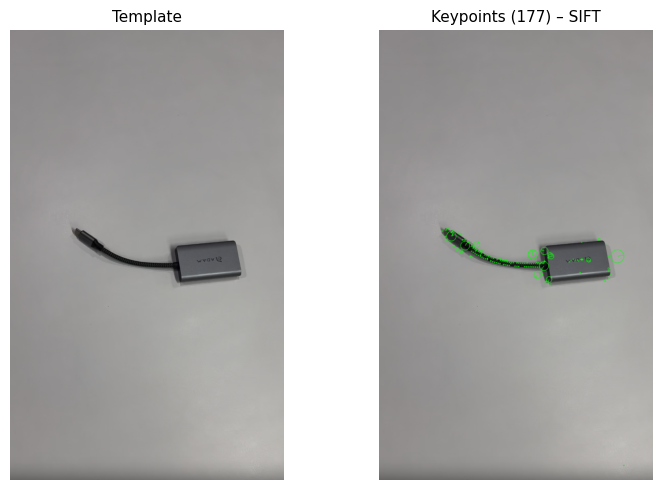 | 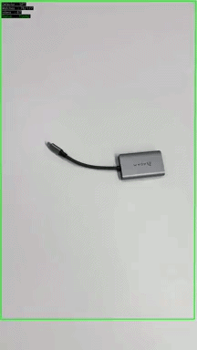 |

**Template:** `templates/easy/template_e4.jpg`  
**Video:** `videos/easy/video_e4.mp4`  
นิตยสาร zoom เข้า-ออกช้าๆ

---

### e5 — Playing card (face card)

| Output frame | Output GIF |
|---|---|
| 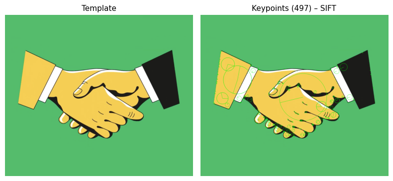 | 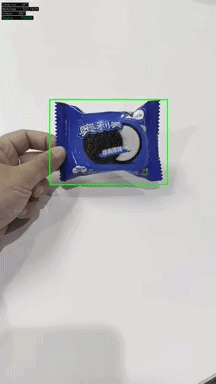 |

**Template:** `templates/easy/template_e5.jpg`  
**Video:** `videos/easy/video_e5.mp4`  
ไพ่บนโต๊ะขาว กล้องเคลื่อนเข้า-ถอยออก

---

## Difficult Success Cases (d1–d5)

มีปัจจัยรบกวน แต่ระบบยังตรวจจับได้ผ่าน threshold ที่ปรับแล้ว

### d1 — Book cover (partial occlusion)

| Output frame | Output GIF |
|---|---|
| 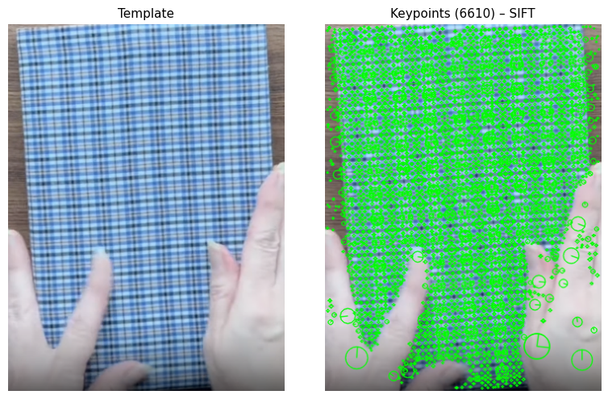 | 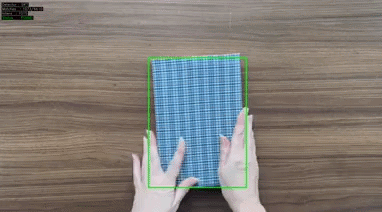 |

**Template:** `templates/difficult/template_d1.jpg`  
**Video:** `videos/difficult/video_d1.mp4`  
หนังสือเล่มเดิมกับ e1 แต่มือบัง ~35% ของปก

---

### d2 — Poster (lighting change)

| Output frame | Output GIF |
|---|---|
| 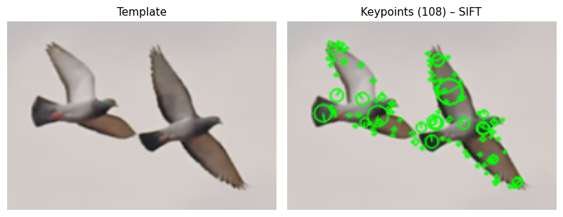 | 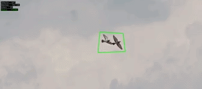 |

**Template:** `templates/difficult/template_d2.jpg`  
**Video:** `videos/difficult/video_d2.mp4`  
Template ถ่ายแสงขาว, video ถ่ายแสงเหลืองอุ่น

---

### d3 — Cereal box (angled view)

| Output frame | Output GIF |
|---|---|
| 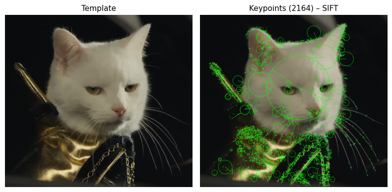 | 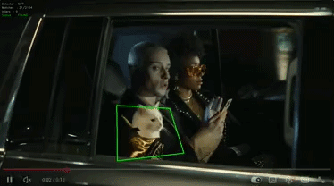 |

**Template:** `templates/difficult/template_d3.jpg`  
**Video:** `videos/difficult/video_d3.mp4`  
กล้อง rotate ทำมุม 50–60° กับหน้ากล่อง

---

### d4 — Textbook (slight bend)

| Output frame | Output GIF |
|---|---|
| 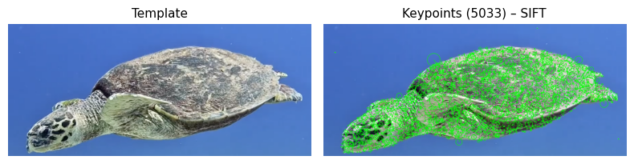 | 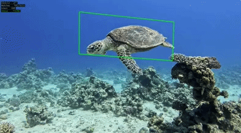 |

**Template:** `templates/difficult/template_d4.jpg`  
**Video:** `videos/difficult/video_d4.mp4`  
หนังสือถูกจับและงอเล็กน้อย ~15–20°

---

### d5 — CD/DVD label (glare)

| Output frame | Output GIF |
|---|---|
| 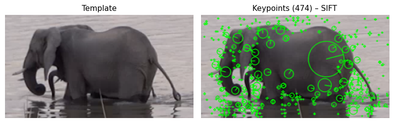 | 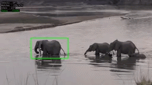 |

**Template:** `templates/difficult/template_d5.jpg`  
**Video:** `videos/difficult/video_d5.mp4`  
Label ซีดีพิมพ์ มีแสงสะท้อนเล็กน้อย

---

## Expected Fail Cases (f1–f5)

วัตถุที่ไม่มี texture / keypoint เพียงพอ — ระบบควร fail ตามที่คาดไว้

### f1 — Scotch book on wooden table

| Output frame | Output GIF |
|---|---|
| 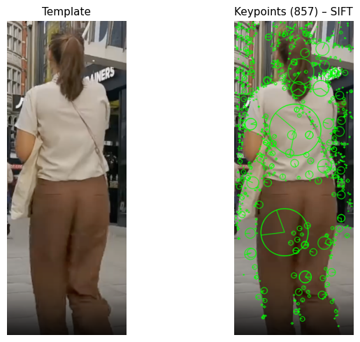 | 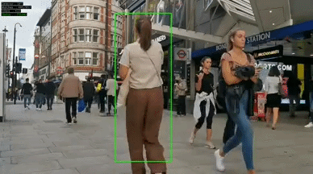 |

**ผลที่คาดหวัง:** หนังสือสกอตวางบนโต๊ะไม้ ปกเรียบไม่มี texture เพียงพอ → ระบบไม่สามารถหา keypoint ได้ → ไม่ detect

---

### f2 — Moving car on road

| Output frame | Output GIF |
|---|---|
| 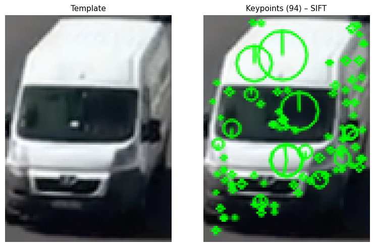 | 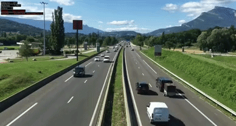 |

**ผลที่คาดหวัง:** รถเคลื่อนที่บนท้องถนน วัตถุเปลี่ยน viewpoint และมี motion blur → feature ไม่ stable → ไม่ detect

---

### f3 — Blank notebook cover

| Output frame | Output GIF |
|---|---|
| 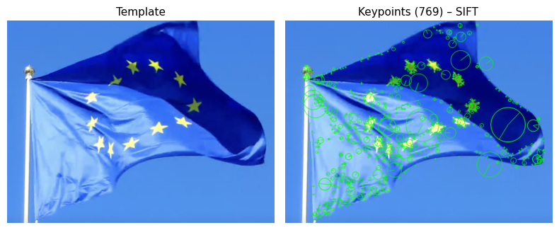 | 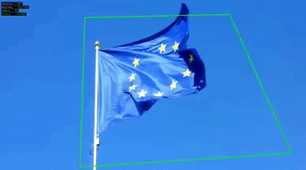 |

**ผลที่คาดหวัง:** ปกสมุดเรียบ ไม่มี texture → ไม่ detect

---

### f4 — Clear glass bottle

| Output frame | Output GIF |
|---|---|
| 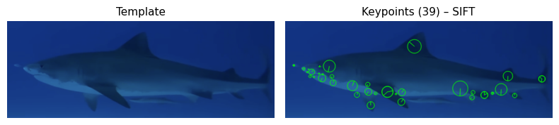 | 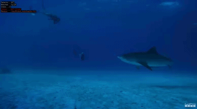 |

**ผลที่คาดหวัง:** ขวดแก้วใส feature เป็นของ background ไม่ใช่วัตถุ → ไม่ detect

---

### f5 — Uniform carpet patch

| Output frame | Output GIF |
|---|---|
| 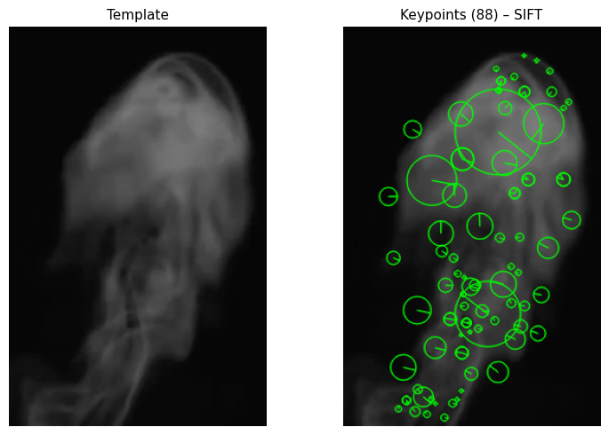 | 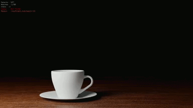 |

**ผลที่คาดหวัง:** พรมลายซ้ำ keypoint ไม่ stable → ไม่ detect

---

## Unexpected Fail Cases (u1–u5)

วัตถุน่าจะตรวจจับได้ แต่ระบบ fail เพราะปัจจัยที่ไม่คาดคิด

### u1 — Plaid Notebook on Wooden Table

| Output frame | Output GIF |
|---|---|
| 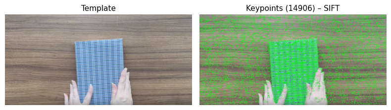 | 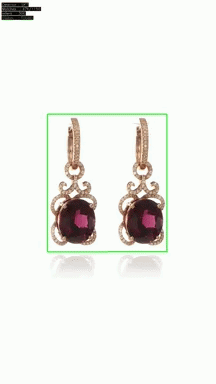 |

**ทำไมคาดว่าน่าจะผ่าน:** สมุดลายตารางสีฟ้าตัดกับโต๊ะไม้สีน้ำตาล contrast ชัดเจน เส้นตารางสร้าง corner/edge ที่ SIFT ชอบ  
**สาเหตุที่ fail:** ลายไม้บนโต๊ะก็มี high-frequency texture คล้ายกัน Descriptor ของจุดบนสมุดกับโต๊ะมีค่าใกล้เคียงกัน ทำให้เกิด outlier จำนวนมาก RANSAC คำนวณ homography ผิดพลาด

---

### u2 — Oreo Wrapper with Cast Shadows

| Output frame | Output GIF |
|---|---|
| 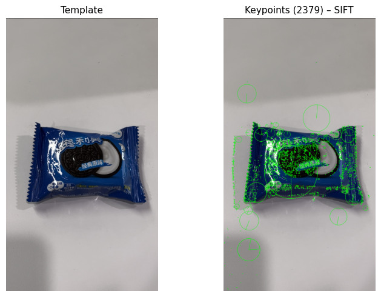 | 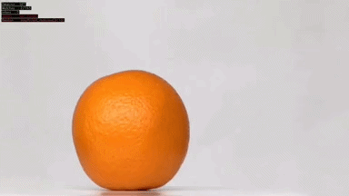 |

**ทำไมคาดว่าน่าจะผ่าน:** ซองสีน้ำเงินเข้มบนพื้นขาว 100% contrast; โลโก้ Oreo เป็น pattern เฉพาะตัวสูง  
**สาเหตุที่ fail:** เงาที่ทอดลงบนซองทำให้ gradient ของภาพเปลี่ยน keypoint ที่อยู่ในโซนเงาหายหรือ descriptor เปลี่ยนจนจับคู่กับ template ไม่ได้

---

### u3 — Playing Card on Dark Cloth

| Output frame | Output GIF |
|---|---|
| 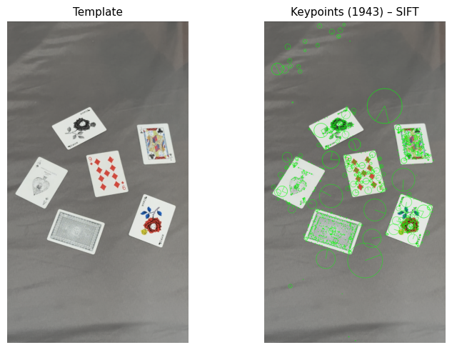 | 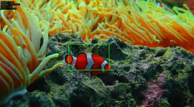 |

**ทำไมคาดว่าน่าจะผ่าน:** ไพ่สีขาวบนผ้าปูสีเทาเข้ม ความต่างความสว่างสูงมาก ขอบวัตถุควรแยกออกได้ง่าย  
**สาเหตุที่ fail:** รอยยับของผ้าปูสร้าง keypoint มากกว่าพื้นที่ขาวเรียบของไพ่ ระบบให้ความสำคัญกับพื้นหลังมากกว่าตัววัตถุ กรอบกระโดดตามรอยยับแทนที่จะ track ไพ่

---

### u4 — Penguin vs Penguin Group & Rocks

| Output frame | Output GIF |
|---|---|
| 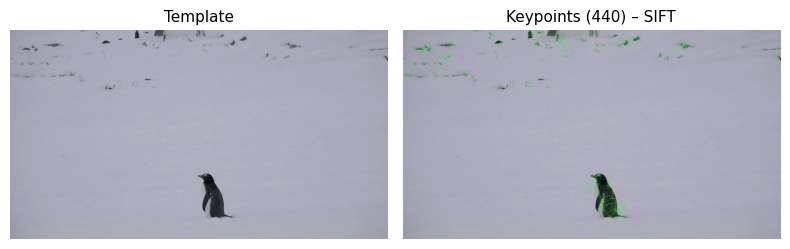 | 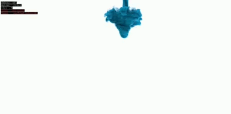 |

**ทำไมคาดว่าน่าจะผ่าน:** เพนกวินสีดำสนิทบนหิมะขาวโพลน เหมือน binary image ทฤษฎีควร segment ได้สมบูรณ์  
**สาเหตุที่ fail:** เพนกวินตัวอื่นและโขดหินในพื้นหลังมี texture signature เหมือนกัน inlier กระจายครอบคลุมทั้งกลุ่ม RANSAC สร้าง homography ที่ขยายกรอบครอบทั้งฉาก (over-segmentation)

---

### u5 — Elephant Herd Crossing River

| Output frame | Output GIF |
|---|---|
| 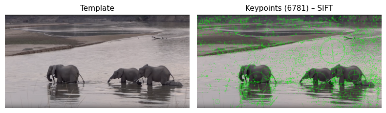 |  |

**ทำไมคาดว่าน่าจะผ่าน:** ช้างมีขนาดใหญ่และ silhouette เป็นเอกลักษณ์ รอยยับและเงาบนผิวควรสร้าง feature ได้  
**สาเหตุที่ fail:** สีผิวช้างกับโคลน/ดินริมแม่น้ำเป็นโทนเดียวกัน (gray/brown) gradient บริเวณขอบวัตถุต่ำมาก ระบบมองช้างและพื้นหลังเป็นผืนเดียวกัน descriptor จาก skin texture จับคู่ผิดกับ rock/mud texture

---

## สรุปผลการทดสอบ

| กลุ่ม | จำนวน | ผลที่คาดหวัง | ผลที่ได้ |
|-------|--------|-------------|---------|
| Easy Success | 5 | ตรวจจับได้ทุก case | ✓ |
| Difficult Success | 5 | ตรวจจับได้แม้มีปัจจัยรบกวน | ✓ |
| Expected Fail | 5 | ไม่ตรวจจับ (ถูกต้อง) | ✓ |
| Unexpected Fail | 5 | ควรตรวจจับได้ แต่ fail | ✓ |

---

## การรันโปรแกรม

```bash
# รัน case เดี่ยว
python run_case.py e2

# รัน case เดี่ยว พร้อม live preview
python run_case.py e2 --show

# จำกัดจำนวน frame (สำหรับทดสอบเร็ว)
python run_case.py e2 --max-frames 60

# รันทุก case และสร้าง results_summary.csv
python run_all.py
```

Output ไฟล์จะอยู่ที่ `outputs/<category>/output_<id>.mp4`, `.png`, `.gif`
